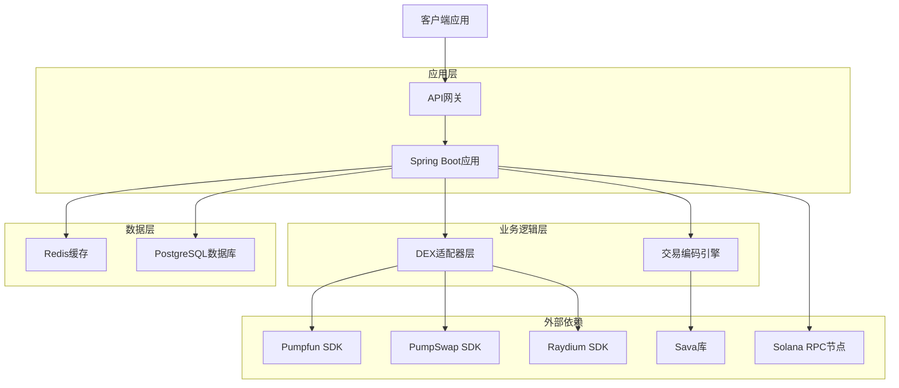
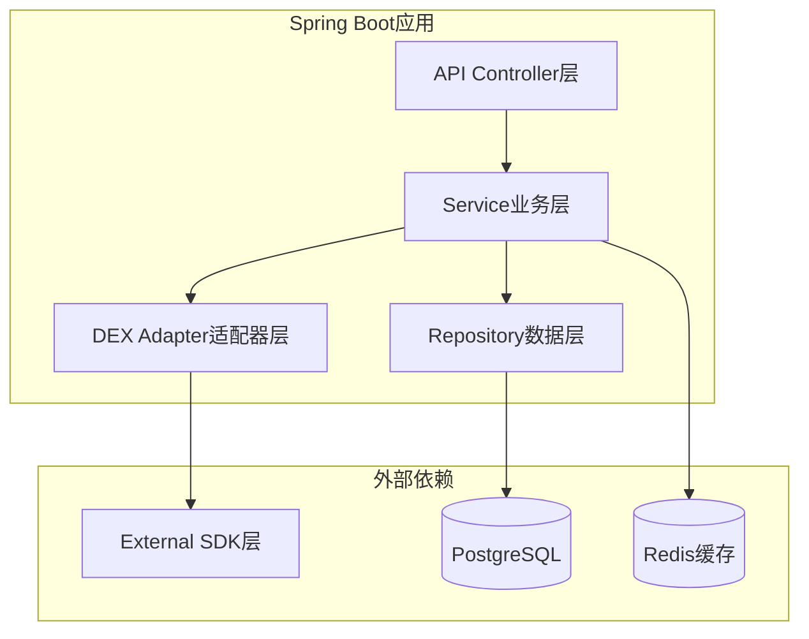
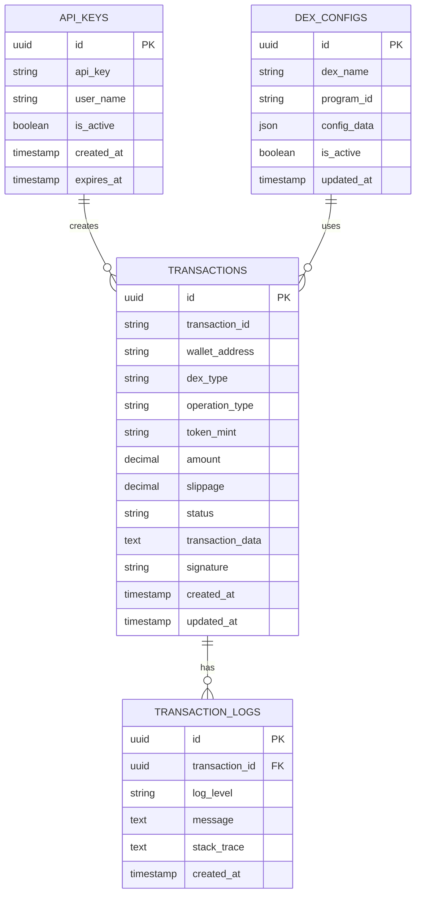

# Solana DEX交易编码服务技术架构文档

## 1. 架构设计



## 2. 技术描述

* 后端：Spring Boot 3.2 + Java 17 + Maven

* 缓存：Redis 7.0

* 数据库：PostgreSQL 15

* 区块链交互：Sava库 + 各DEX官方SDK

* API文档：OpenAPI 3.0 + Swagger UI

* 监控：Micrometer + Prometheus + Grafana

### 2.1 核心依赖配置

**Maven依赖 (pom.xml)**

```xml
<dependencies>
    <!-- Sava库 - Solana官方推荐的Java客户端 -->
    <dependency>
        <groupId>software.sava</groupId>
        <artifactId>sava-core</artifactId>
        <version>1.0.0</version>
    </dependency>
    
    <!-- Spring Boot相关依赖 -->
    <dependency>
        <groupId>org.springframework.boot</groupId>
        <artifactId>spring-boot-starter-web</artifactId>
    </dependency>
    
    <dependency>
        <groupId>org.springframework.boot</groupId>
        <artifactId>spring-boot-starter-data-jpa</artifactId>
    </dependency>
    
    <!-- Redis缓存 -->
    <dependency>
        <groupId>org.springframework.boot</groupId>
        <artifactId>spring-boot-starter-data-redis</artifactId>
    </dependency>
    
    <!-- PostgreSQL驱动 -->
    <dependency>
        <groupId>org.postgresql</groupId>
        <artifactId>postgresql</artifactId>
    </dependency>
</dependencies>
```

### 2.2 Sava库集成优势

* **官方推荐**：Solana官方推荐的Java客户端库，具有更好的兼容性和稳定性
* **高性能**：针对Solana网络优化，提供高效的交易编码和RPC调用
* **完整功能**：支持完整的Solana程序交互，包括账户管理、交易构建、指令编码
* **类型安全**：提供强类型的API接口，减少运行时错误
* **活跃维护**：持续更新以支持Solana网络的最新特性

## 3. 路由定义

| 路由                         | 用途                 |
| -------------------------- | ------------------ |
| /api/v1/encode/pumpfun     | Pumpfun DEX交易编码接口  |
| /api/v1/encode/pumpswap    | PumpSwap DEX交易编码接口 |
| /api/v1/encode/raydium     | Raydium DEX交易编码接口  |
| /api/v1/encode/batch       | 批量交易打包编码接口         |
| /api/v1/transaction/status | 交易状态查询接口           |
| /api/v1/health             | 服务健康检查接口           |
| /admin/metrics             | 系统监控指标接口           |
| /admin/logs                | 系统日志查询接口           |

## 4. API定义

### 4.1 核心API

**Pumpfun交易编码**

```
POST /api/v1/encode/pumpfun
```

请求参数:

| 参数名称          | 参数类型   | 是否必需  | 描述             |
| ------------- | ------ | ----- | -------------- |
| walletAddress | string | true  | 用户钱包地址         |
| tokenMint     | string | true  | 代币合约地址         |
| amount        | string | true  | 交易数量(以最小单位计算)  |
| slippage      | number | false | 滑点容忍度(默认1%)    |
| operation     | string | true  | 操作类型(buy/sell) |

响应参数:

| 参数名称            | 参数类型    | 描述            |
| --------------- | ------- | ------------- |
| success         | boolean | 编码是否成功        |
| transactionData | string  | Base64编码的交易数据 |
| estimatedFee    | number  | 预估交易费用(SOL)   |
| transactionId   | string  | 交易追踪ID        |

请求示例:

```json
{
  "walletAddress": "9WzDXwBbmkg8ZTbNMqUxvQRAyrZzDsGYdLVL9zYtAWWM",
  "tokenMint": "EPjFWdd5AufqSSqeM2qN1xzybapC8G4wEGGkZwyTDt1v",
  "amount": "1000000",
  "slippage": 1.5,
  "operation": "buy"
}
```

响应示例:
```json
{
  "success": true,
  "transactionData": "AQAAAAAAAAAAAAAAAAAAAAAAAAAAAAAAAAAAAAAAAAAAAAAAAAAAAAAAAAAAAAAAAAAAAAAAAAAAAAAAAAAAAAABAAEDArczbMia1tLmq2poP39/+FVtZrfecZEL5pBOCJSfZUEABt324ddloZPZy+FGzut5rju4IKBhuz9zZG8XRgHdDrGQsQbd9uHXZaGT2cvhRs7rea47uCCgYbs/c2RvF0YB3Q6xkAAAAAAAAAAAAAAAAAAAAAAAAAAAAAAAAAAAAAAAAAACAgEBARIJAQAAAADh9QUAAAAABgEBAgECAAkD",
  "estimatedFee": 0.000005,
  "transactionId": "tx_1234567890abcdef"
}
```

### 4.2 Sava库实现示例

**交易编码核心代码**

```java
@Service
public class SolanaTransactionService {
    
    private final SolanaRpcClient rpcClient;
    
    public TransactionEncodeResponse encodePumpfunTransaction(
            String walletAddress, 
            String tokenMint, 
            String amount, 
            double slippage, 
            String operation) {
        
        try {
            // 使用Sava库创建交易
            PublicKey wallet = PublicKey.fromBase58(walletAddress);
            PublicKey token = PublicKey.fromBase58(tokenMint);
            
            // 构建Pumpfun交易指令
            TransactionInstruction instruction = createPumpfunInstruction(
                wallet, token, new BigInteger(amount), operation
            );
            
            // 创建交易
            Transaction transaction = Transaction.builder()
                .addInstruction(instruction)
                .setRecentBlockHash(getRecentBlockhash())
                .setFeePayer(wallet)
                .build();
            
            // 序列化交易
            byte[] serializedTx = transaction.serialize();
            String encodedTx = Base64.getEncoder().encodeToString(serializedTx);
            
            return TransactionEncodeResponse.builder()
                .success(true)
                .transactionData(encodedTx)
                .estimatedFee(calculateFee(transaction))
                .transactionId(generateTransactionId())
                .build();
                
        } catch (Exception e) {
            log.error("Failed to encode Pumpfun transaction", e);
            return TransactionEncodeResponse.builder()
                .success(false)
                .error(e.getMessage())
                .build();
        }
    }
    
    private TransactionInstruction createPumpfunInstruction(
            PublicKey wallet, 
            PublicKey token, 
            BigInteger amount, 
            String operation) {
        
        // 使用Sava库构建Pumpfun特定的交易指令
        ProgramId pumpfunProgram = ProgramId.fromBase58("6EF8rrecthR5Dkzon8Nwu78hRvfCKubJ14M5uBEwF6P");
        
        InstructionBuilder builder = InstructionBuilder.create(pumpfunProgram)
            .addAccount(wallet, true, true)  // 签名者账户
            .addAccount(token, false, false); // 代币账户
            
        // 根据操作类型添加不同的数据
        if ("buy".equals(operation)) {
            builder.addData(encodeSwapInstruction(amount, true));
        } else {
            builder.addData(encodeSwapInstruction(amount, false));
        }
        
        return builder.build();
    }
}
```

**批量交易打包**

```
POST /api/v1/encode/batch
```

请求参数:

| 参数名称          | 参数类型   | 是否必需  | 描述             |
| ------------- | ------ | ----- | -------------- |
| walletAddress | string | true  | 用户钱包地址         |
| transactions  | array  | true  | 交易列表           |
| priorityFee   | number | false | 优先费用(lamports) |

**交易状态查询**

```
GET /api/v1/transaction/status/{transactionId}
```

响应参数:

| 参数名称          | 参数类型   | 描述                             |
| ------------- | ------ | ------------------------------ |
| transactionId | string | 交易ID                           |
| status        | string | 交易状态(pending/confirmed/failed) |
| signature     | string | 链上交易签名                         |
| blockTime     | number | 区块确认时间                         |
| error         | string | 错误信息(如果失败)                     |

## 5. 服务器架构图



## 6. 数据模型

### 6.1 数据模型定义



### 6.2 数据定义语言

**API密钥表 (api\_keys)**

```sql
-- 创建表
CREATE TABLE api_keys (
    id UUID PRIMARY KEY DEFAULT gen_random_uuid(),
    api_key VARCHAR(64) UNIQUE NOT NULL,
    user_name VARCHAR(100) NOT NULL,
    is_active BOOLEAN DEFAULT true,
    rate_limit INTEGER DEFAULT 1000,
    created_at TIMESTAMP WITH TIME ZONE DEFAULT NOW(),
    expires_at TIMESTAMP WITH TIME ZONE
);

-- 创建索引
CREATE INDEX idx_api_keys_api_key ON api_keys(api_key);
CREATE INDEX idx_api_keys_user_name ON api_keys(user_name);

-- 初始化数据
INSERT INTO api_keys (api_key, user_name, rate_limit) VALUES 
('dev_key_12345678901234567890123456789012', 'developer_test', 10000),
('prod_key_98765432109876543210987654321098', 'production_user', 5000);
```

**交易记录表 (transactions)**

```sql
-- 创建表
CREATE TABLE transactions (
    id UUID PRIMARY KEY DEFAULT gen_random_uuid(),
    transaction_id VARCHAR(64) UNIQUE NOT NULL,
    api_key_id UUID REFERENCES api_keys(id),
    wallet_address VARCHAR(44) NOT NULL,
    dex_type VARCHAR(20) NOT NULL CHECK (dex_type IN ('pumpfun', 'pumpswap', 'raydium', 'batch')),
    operation_type VARCHAR(20) NOT NULL,
    token_mint VARCHAR(44),
    amount DECIMAL(20,8),
    slippage DECIMAL(5,2),
    status VARCHAR(20) DEFAULT 'pending' CHECK (status IN ('pending', 'encoded', 'confirmed', 'failed')),
    transaction_data TEXT,
    signature VARCHAR(88),
    estimated_fee DECIMAL(10,8),
    created_at TIMESTAMP WITH TIME ZONE DEFAULT NOW(),
    updated_at TIMESTAMP WITH TIME ZONE DEFAULT NOW()
);

-- 创建索引
CREATE INDEX idx_transactions_transaction_id ON transactions(transaction_id);
CREATE INDEX idx_transactions_wallet_address ON transactions(wallet_address);
CREATE INDEX idx_transactions_status ON transactions(status);
CREATE INDEX idx_transactions_created_at ON transactions(created_at DESC);
```

**DEX配置表 (dex\_configs)**

```sql
-- 创建表
CREATE TABLE dex_configs (
    id UUID PRIMARY KEY DEFAULT gen_random_uuid(),
    dex_name VARCHAR(50) UNIQUE NOT NULL,
    program_id VARCHAR(44) NOT NULL,
    config_data JSONB NOT NULL,
    is_active BOOLEAN DEFAULT true,
    updated_at TIMESTAMP WITH TIME ZONE DEFAULT NOW()
);

-- 初始化DEX配置数据
INSERT INTO dex_configs (dex_name, program_id, config_data) VALUES 
('pumpfun', '6EF8rrecthR5Dkzon8Nwu78hRvfCKubJ14M5uBEwF6P', '{"fee_rate": 0.0025, "min_amount": 1000}'),
('pumpswap', '9xQeWvG816bUx9EPjHmaT23yvVM2ZWbrrpZb9PusVFin', '{"fee_rate": 0.003, "min_amount": 500}'),
('raydium', '675kPX9MHTjS2zt1qfr1NYHuzeLXfQM9H24wFSUt1Mp8', '{"fee_rate": 0.0025, "min_amount": 1000}');
```

