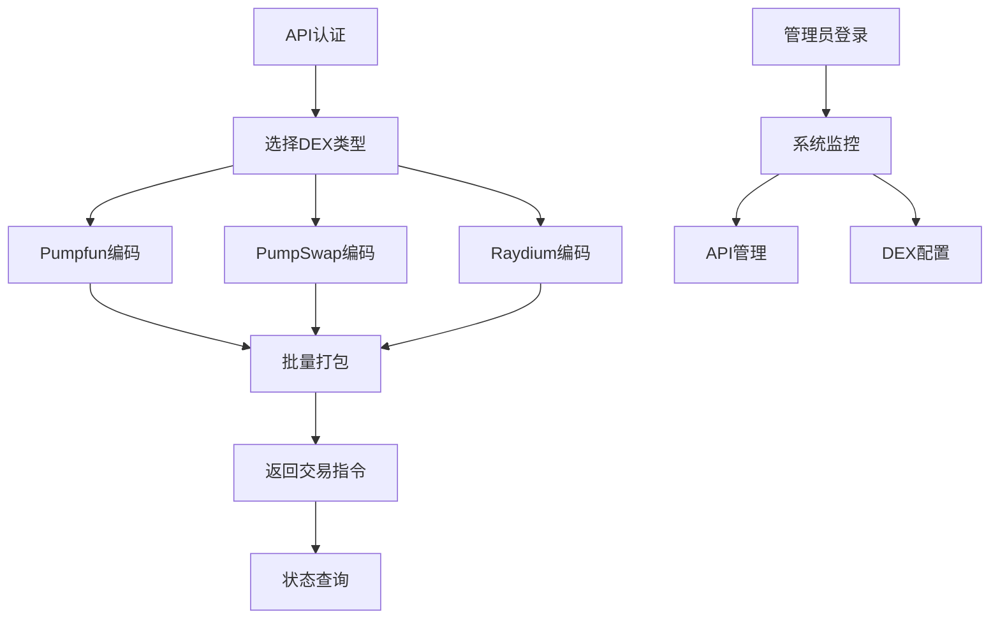

# Solana DEX交易编码服务需求文档

## 1. 产品概述

本项目旨在开发一个Java服务，用于在Solana区块链上为多个去中心化交易所(DEX)生成和编码打包交易指令。
该服务将支持Pumpfun、PumpSwap、Raydium三个主要DEX平台，为用户提供统一的交易编码接口，简化多DEX交易操作流程。
目标是为DeFi开发者和交易机器人提供高效、可靠的交易编码解决方案。

## 2. 核心功能

### 2.1 用户角色

| 角色 | 注册方式 | 核心权限 |
|------|----------|----------|
| API用户 | API密钥申请 | 可调用所有交易编码接口，查看交易状态 |
| 管理员 | 系统内部配置 | 可管理API密钥，监控系统状态，配置DEX参数 |

### 2.2 功能模块

我们的Solana DEX交易编码服务包含以下主要功能模块：
1. **交易编码接口**：为不同DEX生成交易指令，支持批量打包操作
2. **DEX适配器管理**：管理Pumpfun、PumpSwap、Raydium的协议适配
3. **交易状态查询**：查询交易编码结果和执行状态
4. **系统监控面板**：监控服务状态、API调用统计、错误日志

### 2.3 页面详情

| 页面名称 | 模块名称 | 功能描述 |
|----------|----------|----------|
| 交易编码接口 | Pumpfun适配器 | 生成Pumpfun DEX的交易指令，支持代币交换、流动性操作 |
| 交易编码接口 | PumpSwap适配器 | 生成PumpSwap DEX的交易指令，支持AMM交易、LP操作 |
| 交易编码接口 | Raydium适配器 | 生成Raydium DEX的交易指令，支持集中流动性、农场质押 |
| 交易编码接口 | 批量打包器 | 将多个DEX操作打包成单个交易，优化Gas费用 |
| 交易状态查询 | 状态追踪器 | 查询交易编码结果、链上执行状态、错误信息 |
| 系统监控面板 | 性能监控 | 显示API调用量、响应时间、成功率统计 |
| 系统监控面板 | 错误日志 | 记录和展示系统错误、异常情况、调试信息 |

## 3. 核心流程

**API用户流程：**
用户通过API密钥认证后，调用相应的DEX交易编码接口，传入交易参数（如代币地址、数量、滑点等），服务返回编码后的交易指令。用户可选择单个DEX操作或批量打包多个DEX操作。最后通过状态查询接口跟踪交易执行情况。

**管理员流程：**
管理员通过系统监控面板查看服务运行状态，管理API密钥的分配和权限，配置各DEX的协议参数，处理异常情况和系统维护。

## 4. 用户界面设计

### 4.1 设计风格

- 主色调：深蓝色(#1a365d)和绿色(#38a169)，体现区块链和金融科技特色
- 按钮样式：圆角矩形，带有轻微阴影效果
- 字体：主要使用Roboto字体，代码部分使用Monaco等宽字体
- 布局风格：卡片式布局，顶部导航栏，左侧功能菜单
- 图标风格：使用简洁的线性图标，支持暗色主题

### 4.2 页面设计概览

| 页面名称 | 模块名称 | UI元素 |
|----------|----------|--------|
| 交易编码接口 | API调用面板 | 深色背景，JSON格式输入框，语法高亮，一键复制按钮 |
| 交易状态查询 | 状态展示区 | 表格布局，状态指示灯(绿色成功/红色失败/黄色处理中) |
| 系统监控面板 | 数据图表 | 实时折线图，饼状图，使用Chart.js库，响应式设计 |
| 系统监控面板 | 日志显示 | 滚动文本区域，按级别颜色编码(错误红色/警告黄色/信息蓝色) |

### 4.3 响应式设计

服务主要面向开发者，采用桌面优先设计，同时支持平板设备访问。移动端提供基础的状态查询功能，优化触摸交互体验。